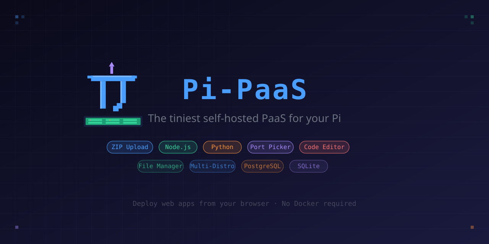

[](assets/banner.svg)

[](https://github.com/HexLions/pi-paas)
[](https://github.com/HexLions/pi-paas/blob/main/LICENSE)
[](https://nodejs.org)
[](https://github.com/HexLions/pi-paas/tree/docker)
[](https://github.com/HexLions/pi-paas)

**The tiniest self-hosted PaaS for your Raspberry Pi (and any Linux box)**  
Deploy, manage, edit and backup web apps directly from your browser.  
Available in two editions: **Standalone** (no Docker) and **Docker** (containerized apps).

---

## 🔀 Two Editions

|  | **Standalone** (`main` branch) | **Docker Edition** (`docker` branch) |
| --- | --- | --- |
| **Apps run as** | Native processes | Docker containers |
| **Isolation** | Shared filesystem | Full container isolation |
| **Requires Docker** | ❌ No | ✅ Yes |
| **Install** | `bash install.sh` | `docker compose up -d` |
| **Best for** | Raspberry Pi, lightweight setups | Production, multi-app servers |
| **App deployment** | Upload ZIP → process spawned | Upload ZIP → image built → container started |
| **Port management** | Direct port binding | Docker port mapping |
| **Auto-Dockerfile** | N/A | Generated for Node, Python, Static if missing |
| **Custom Dockerfile** | N/A | ✅ Use your own if included in ZIP |

```
HexLions/pi-paas
├── main    ← Standalone Edition (this branch)
└── docker  ← Docker Edition
```

👉 **Want the Docker edition?** Switch to the [`docker` branch](https://github.com/HexLions/pi-paas/tree/docker)

---

## ✨ Features

* 🚀 **One-click deploy** — Upload a `.zip` or single `.html` file and it's live
* 🔌 **4 app types** — Static HTML, Node.js, Python/Flask, React/Vue
* 🗃️ **3 database options** — None, SQLite, or PostgreSQL (per-app, custom naming)
* 🎯 **Port picker** — Choose your port or auto-assign, with live availability check against system processes
* 📂 **Built-in code editor** — CodeMirror with syntax highlighting for 10+ languages, line numbers, bracket matching, code folding, search & replace, autocomplete
* 📋 **Live logs** — View each app's stdout/stderr from the panel
* 💾 **Backup system** — Manual or scheduled (daily/weekly) backups with one-click restore, download, and automatic rotation (keeps last 5)
* 🗃️ **Database management** — Rename SQLite or PostgreSQL databases from the panel
* 🔄 **Auto-restart** — Apps survive reboots via systemd/OpenRC
* 📦 **Safe updates** — App data lives in `~/pi-paas-data/`, never touched by Pi-PaaS code updates
* 🐧 **Multi-distro** — Debian, Ubuntu, DietPi, Raspberry Pi OS, Fedora, CentOS, Arch, Alpine, openSUSE
* 🐳 **Docker edition available** — Each app runs in its own container with full isolation

---

## 🚀 Quick Start

### Standalone (no Docker)

```bash
git clone https://github.com/HexLions/pi-paas.git
cd pi-paas
bash install.sh
# → http://<your-ip>:9000
```

### Via SCP

```bash
scp -r pi-paas/ root@your-pi:~/
ssh root@your-pi
cd ~/pi-paas && bash install.sh
```

---

## 🐧 Supported Distributions

| Family | Distributions |
| --- | --- |
| **Debian** | Debian, Ubuntu, DietPi, Raspberry Pi OS, Linux Mint, Pop!\_OS, Kali, Zorin, elementary |
| **Fedora** | Fedora, CentOS, Rocky Linux, AlmaLinux, RHEL |
| **Arch** | Arch Linux, Manjaro, EndeavourOS, Garuda |
| **Alpine** | Alpine Linux |
| **SUSE** | openSUSE Leap, openSUSE Tumbleweed, SLES |

---

## 📁 Architecture

```
~/pi-paas/                  ← Code (safe to delete & reinstall)
├── backend/server.js
├── frontend/index.html
├── assets/
├── install.sh
├── package.json
├── LICENSE
└── README.md

~/pi-paas-data/             ← Your data (NEVER touched by updates)
├── apps/
├── backups/
├── logs/
├── uploads/
└── registry.json
```

---

## 📱 Deploying Apps

### Static HTML/CSS/JS

Upload a `.zip` containing an `index.html`, or upload a single `.html` file directly:

```
my-site.zip
├── index.html
├── style.css
└── script.js
```

### Node.js

Your app must read the port from `process.env.PORT`:

```js
const PORT = process.env.PORT || 3000;
app.listen(PORT, () => console.log(`Running on ${PORT}`));
```

### Python / Flask

Your app must read the port from `os.environ['PORT']`:

```python
import os
port = int(os.environ.get('PORT', 3000))
app.run(host='0.0.0.0', port=port)
```

### React / Vue

Upload the full project with `package.json`. Pi-PaaS runs `npm install` + `npm run build` and serves `build/` or `dist/`.

---

## 🎯 Port Selection

* **Leave empty** → auto-assigns next free port (3001–3200)
* **Enter a specific port** → click "Check" to verify availability
* **Change later** → update port from the Update modal

The checker scans both Pi-PaaS apps and system processes (via `ss`/`netstat`).

---

## 🗃️ Database Management

* Choose **SQLite**, **PostgreSQL**, or **None** at deploy time
* Set a **custom database name** (auto-generated if empty)
* **Rename** databases later via the 🗃️ DB button

| Variable | Description |
| --- | --- |
| `PORT` | Assigned port (3001–3200) |
| `DATABASE_URL` | Database connection string |
| `SQLITE_PATH` | Path to `.db` file (SQLite only) |
| `PGDATABASE` | PostgreSQL database name (PG only) |

---

## 💾 Backup System

* **Manual** — click "Create Backup Now" for instant `.tar.gz` archive
* **Scheduled** — Daily (3am) or Weekly (Sunday 3am) via `node-cron`
* **Contents** — app files + PostgreSQL dump + SQLite DB + metadata
* **Restore** — one-click: stops app, restores files + DB, restarts
* **Download** — grab any backup as `.tar.gz`
* **Auto-rotation** — keeps last 5 backups per app

Backups stored in `~/pi-paas-data/backups/<app-id>/`.

---

## ⌨️ Editor Shortcuts

| Shortcut | Action |
| --- | --- |
| `Ctrl+S` | Save file |
| `Ctrl+F` | Find |
| `Ctrl+H` | Find & Replace |
| `Ctrl+/` | Toggle comment |
| `Ctrl+Z` | Undo |
| `Ctrl+Shift+Z` | Redo |
| `Tab` / `Shift+Tab` | Indent / Unindent |
| `Ctrl+Space` | Autocomplete |
| `Ctrl+J` | Jump to matching tag |

Supported: HTML, CSS, JavaScript, JSON, Python, Markdown, SQL, Shell, YAML, XML.

---

## 🔄 Updating

```bash
cd ~ && rm -rf pi-paas/
git clone https://github.com/HexLions/pi-paas.git
cd pi-paas && bash install.sh   # Apps, DBs, backups untouched!
```

---

## 🛠️ Service Management

```bash
systemctl status pi-paas
journalctl -u pi-paas -f
systemctl restart pi-paas
```

---

## 🔗 Accessing the Panel

| Method | URL |
| --- | --- |
| **Direct** | `http://<IP>:9000` |
| **Via nginx** | `http://<IP>/pi-paas/` |
| **Each app** | `http://<IP>:<assigned-port>` |

---

## 📋 Changelog

### v1.0.0 (Current)

* 💾 Backup system with manual/scheduled backups, restore, download, auto-rotation
* 🗃️ Database management — custom DB names, rename SQLite/PostgreSQL
* 🎯 Port picker with system port scanning
* 📂 Built-in CodeMirror editor with syntax highlighting
* 📁 File manager with create/edit/delete
* 🐧 Multi-distro installer (Debian, Fedora, Arch, Alpine, SUSE)
* 📦 Safe update architecture (code vs data separation)
* 🚀 Deploy static HTML, Node.js, Python, React apps
* 🔄 Auto-restart on reboot via systemd/OpenRC
* 🐳 Docker edition with containerized apps via Docker socket + dockerode

---

## 🤝 Contributing

Contributions, issues and feature requests are welcome! Check the [issues page](https://github.com/HexLions/pi-paas/issues).

---

## 📄 License

This project is licensed under the **GNU General Public License v3.0** — see the [LICENSE](https://github.com/HexLions/pi-paas/blob/main/LICENSE) file for details.

This means you are free to use, modify and distribute this software, but any derivative work must also be released under GPL-3.0 with source code available.

Made with ❤️ by [HexLions](https://github.com/HexLions)
