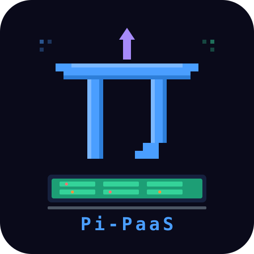

<p align="center">
  
</p>

<p align="center">
  
  
  
  
</p>

<p align="center">
  <strong>The tiniest self-hosted PaaS for your Raspberry Pi (and any Linux box)</strong><br/>
  Deploy, manage and edit web apps directly from your browser.<br/>
  No Docker. No Git. Just upload a ZIP and go.
</p>

---

## ✨ Features

- 🚀 **One-click deploy** — Upload a `.zip` or single `.html` file and it's live
- 🔌 **4 app types** — Static HTML, Node.js, Python/Flask, React/Vue
- 🗃️ **3 database options** — None, SQLite, or PostgreSQL (per-app)
- 🎯 **Port picker** — Choose your port or auto-assign, with live availability check against system processes
- 📂 **Built-in code editor** — CodeMirror with syntax highlighting, line numbers, bracket matching, code folding, search & replace
- 📋 **Live logs** — View each app's stdout/stderr from the panel
- 🔄 **Auto-restart** — Apps survive reboots via systemd/OpenRC
- 📦 **Safe updates** — App data lives in `~/pi-paas-data/`, never touched by Pi-PaaS code updates
- 🐧 **Multi-distro** — Debian, Ubuntu, DietPi, Raspberry Pi OS, Fedora, CentOS, Arch, Alpine, openSUSE

## 📸 Screenshots

<p align="center">
  
</p>

> The panel runs on port `9000` and shows all deployed apps as cards with status, port, type, URL, and action buttons (start/stop/restart/update/files/logs/delete).

## 🚀 Quick Start

```bash
# Clone the repo
git clone https://github.com/HexLions/pi-paas.git
cd pi-paas

# Run the installer (auto-detects your distro)
bash install.sh

# Open your browser
# http://<your-ip>:9000
```

Or deploy via SCP:

```bash
scp -r pi-paas/ root@your-pi:~/
ssh root@your-pi
cd ~/pi-paas && bash install.sh
```

## 🐧 Supported Distributions

| Family | Distributions |
|--------|--------------|
| **Debian** | Debian, Ubuntu, DietPi, Raspberry Pi OS, Linux Mint, Pop!_OS, Kali, Zorin, elementary |
| **Fedora** | Fedora, CentOS, Rocky Linux, AlmaLinux, RHEL |
| **Arch** | Arch Linux, Manjaro, EndeavourOS, Garuda |
| **Alpine** | Alpine Linux |
| **SUSE** | openSUSE Leap, openSUSE Tumbleweed, SLES |

The installer auto-detects your distribution via `/etc/os-release` and uses the correct package manager (`apt`, `dnf`, `pacman`, `apk`, or `zypper`).

## 📁 Architecture

```
~/pi-paas/                  ← Code (safe to delete & reinstall)
├── backend/server.js
├── frontend/index.html
├── assets/
│   ├── logo.svg
│   └── banner.svg
├── install.sh
├── package.json
├── LICENSE
└── README.md

~/pi-paas-data/             ← Your data (NEVER touched by updates)
├── apps/
│   ├── my-portfolio/
│   ├── api-backend/
│   └── ...
├── logs/
├── uploads/
└── registry.json
```

## 📱 Deploying Apps

### Static HTML/CSS/JS

Upload a `.zip` containing an `index.html`, or upload a single `.html` file directly:

```
my-site.zip
├── index.html
├── style.css
└── script.js
```

### Node.js

Your app must read the port from `process.env.PORT`:

```javascript
const PORT = process.env.PORT || 3000;
app.listen(PORT, () => console.log(`Running on ${PORT}`));
```

### Python / Flask

Your app must read the port from `os.environ['PORT']`:

```python
import os
port = int(os.environ.get('PORT', 3000))
app.run(host='0.0.0.0', port=port)
```

### React / Vue

Upload the full project with `package.json`. Pi-PaaS runs `npm install` + `npm run build` automatically and serves the `build/` or `dist/` folder.

## 🎯 Port Selection

When deploying, you can either:

- **Leave the port field empty** → Pi-PaaS auto-assigns the next free port (3001–3200)
- **Enter a specific port** → Click "Check" to verify availability

The port checker scans both:
- Ports used by other Pi-PaaS apps
- Ports used by system processes (via `ss`/`netstat`)

You can also change an app's port later from the Update modal.

## 🔧 Environment Variables

Each app automatically receives:

| Variable | Description |
|----------|-------------|
| `PORT` | Assigned port (3001–3200) |
| `APP_PORT` | Alias of PORT |
| `DATABASE_URL` | Database connection string (if configured) |
| `SQLITE_PATH` | Path to `.db` file (SQLite only) |
| `PGDATABASE` | PostgreSQL database name (PG only) |

## ⌨️ Editor Shortcuts

| Shortcut | Action |
|----------|--------|
| `Ctrl+S` | Save file |
| `Ctrl+F` | Find |
| `Ctrl+H` | Find & Replace |
| `Ctrl+/` | Toggle comment |
| `Ctrl+Z` | Undo |
| `Ctrl+Shift+Z` | Redo |
| `Tab` | Indent |
| `Shift+Tab` | Unindent |
| `Ctrl+Space` | Autocomplete |
| `Ctrl+J` | Jump to matching tag |

Supported languages: HTML, CSS, JavaScript, JSON, Python, Markdown, SQL, Shell, YAML, XML.

## 🔄 Updating Pi-PaaS

Your apps are safe — they live in `~/pi-paas-data/`:

```bash
cd ~
rm -rf pi-paas/                              # Remove old code
git clone https://github.com/HexLions/pi-paas.git   # Get new version
cd pi-paas && bash install.sh                # Reinstall — apps untouched!
```

## 🛠️ Service Management

```bash
# Status
systemctl status pi-paas

# View panel logs
journalctl -u pi-paas -f

# Restart the panel
systemctl restart pi-paas
```

## 🔗 Accessing the Panel

| Method | URL |
|--------|-----|
| **Direct** | `http://<IP>:9000` |
| **Via nginx** | `http://<IP>/pi-paas/` |
| **Each app** | `http://<IP>:<assigned-port>` |

## 🤝 Contributing

Contributions, issues and feature requests are welcome! Feel free to check the [issues page](https://github.com/HexLions/pi-paas/issues).

## 📄 License

[MIT](LICENSE) — Made with ❤️ by [HexLions](https://github.com/HexLions)
