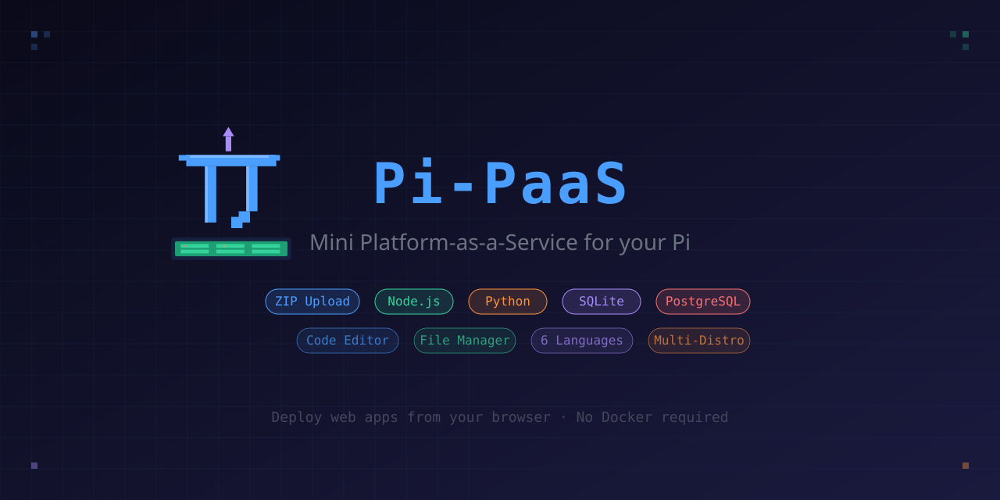

<p align="center">
  
</p>

<h1 align="center">π Pi-PaaS</h1>

<p align="center">
  <strong>The tiniest self-hosted PaaS for your Raspberry Pi (and beyond)</strong>
</p>

<p align="center">
  
  
  
  
  
</p>

<p align="center">
  Deploy, manage and edit web apps directly from your browser.<br/>
  No Docker. No Git. Just upload a ZIP and go.
</p>

---

## ✨ Features

🚀 **One-click deploy** — Upload a `.zip` or `.html` file from the browser and it's live

📂 **Built-in code editor** — Edit files with syntax highlighting (CodeMirror), line numbers, bracket matching, code folding, search & replace

🌍 **6 languages** — English, Italiano, Español, Français, Deutsch, 日本語

🔌 **4 app types** — Static HTML, Node.js, Python/Flask, React/Vue

🗃️ **3 database options** — None, SQLite, or PostgreSQL (per-app)

📊 **Live logs** — View app logs from the panel in real-time

🔄 **Auto-restart** — Apps survive reboots via systemd/OpenRC

📦 **Safe updates** — App data lives in a separate directory, never touched by Pi-PaaS updates

🐧 **Multi-distro** — Works on Debian, Ubuntu, DietPi, Raspberry Pi OS, Fedora, CentOS, Arch, Alpine, openSUSE

## 📁 Architecture

```
~/pi-paas/                  ← Code (safe to delete & update)
├── backend/server.js       ← API server
├── frontend/
│   ├── index.html          ← Panel UI
│   └── i18n.js             ← Translations
├── assets/                 ← Logo & banner
├── install.sh              ← Multi-distro installer
└── package.json

~/pi-paas-data/             ← Your data (NEVER touched by updates)
├── apps/                   ← Deployed app files
│   ├── my-portfolio/
│   ├── api-backend/
│   └── ...
├── logs/                   ← Per-app log files
├── uploads/                ← Temp upload storage
└── registry.json           ← App registry
```

## 🚀 Quick Start

```bash
# 1. Download or clone
git clone https://github.com/HexLions/pi-paas.git
cd pi-paas

# 2. Run the installer
bash install.sh

# 3. Open your browser
# http://<your-ip>:9000
```

Or via SCP:

```bash
scp -r pi-paas/ user@your-pi:~/
ssh user@your-pi
cd ~/pi-paas && bash install.sh
```

## 🐧 Supported Distributions

| Family | Distributions |
|--------|--------------|
| **Debian** | Debian, Ubuntu, DietPi, Raspberry Pi OS, Linux Mint, Pop!_OS, Kali, Zorin, elementary |
| **Fedora** | Fedora, CentOS, Rocky Linux, AlmaLinux, RHEL, Nobara |
| **Arch** | Arch Linux, Manjaro, EndeavourOS, Garuda |
| **Alpine** | Alpine Linux |
| **SUSE** | openSUSE Leap/Tumbleweed, SLES |

The installer auto-detects your distribution and uses the appropriate package manager.

## 📱 How to Deploy Apps

### Static HTML/CSS/JS
Just ZIP your files (must include `index.html`):
```
my-site.zip
├── index.html
├── style.css
└── script.js
```

Or upload a single `.html` file directly.

### Node.js
Your app must read the port from `process.env.PORT`:
```javascript
const PORT = process.env.PORT || 3000;
app.listen(PORT);
```

### Python / Flask
Your app must read the port from `os.environ['PORT']`:
```python
port = int(os.environ.get('PORT', 3000))
app.run(host='0.0.0.0', port=port)
```

### React / Vue
Upload the project with `package.json`. Pi-PaaS runs `npm install` + `npm run build` and serves the `build/` or `dist/` folder.

## 🔧 Environment Variables

Each app automatically receives:

| Variable | Description |
|----------|-------------|
| `PORT` | Assigned port (3001-3200) |
| `DATABASE_URL` | Database connection string (if configured) |
| `SQLITE_PATH` | Path to `.db` file (SQLite only) |
| `PGDATABASE` | PostgreSQL database name (PG only) |

## 🔄 Updating Pi-PaaS

Your apps are safe — they live in `~/pi-paas-data/`:

```bash
cd ~
rm -rf pi-paas/           # Delete old code only
git clone https://github.com/HexLions/pi-paas.git
cd pi-paas && bash install.sh   # Apps untouched!
```

## ⌨️ Editor Shortcuts

| Shortcut | Action |
|----------|--------|
| `Ctrl+S` | Save file |
| `Ctrl+F` | Find |
| `Ctrl+H` | Find & Replace |
| `Ctrl+/` | Toggle comment |
| `Ctrl+Z` | Undo |
| `Ctrl+Shift+Z` | Redo |
| `Tab` | Indent |
| `Ctrl+Space` | Autocomplete |

## 🛠️ Service Management

```bash
# Status
systemctl status pi-paas

# View logs
journalctl -u pi-paas -f

# Restart
systemctl restart pi-paas
```

## 🤝 Contributing

Contributions are welcome! Feel free to open issues or submit pull requests.

## 📄 License

MIT License — see [LICENSE](LICENSE) for details.

---

<p align="center">
  Made with ❤️ by <a href="https://github.com/HexLions">HexLions</a>
</p>
